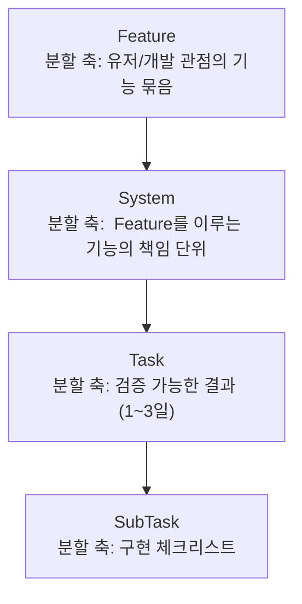

# 작업 카드 정의
> 내가(쌤이)쓰는거니 회사마다 다를 수 있음. 보통 보면 워딩만 다름

---

작업의 크기와 추상도. `Feature → System → Task → SubTask`



---

### 요약표

| 항목 | 내용 | 검증 단계 | 작업 시간 |
|------|---------|:---:|:---:|
| **Feature** | 유저/개발 관점의 기능 묶음 | △ (라벨/에픽) | 수 주 ~ |
| **System** | Feature를 이루는 연관된 기능의 책임 단위 | △ (라벨/에픽) | 수 일 ~ 주 |
| **Task** | 검증 가능한 결과. 프로그래밍적인 기능의 한 단위 | | **1~3일** |
| **SubTask** | 구현 체크리스트 | 작업자 맘대로 |  |

> 프로그래머 입장에서 보지말고 유저 입장에서 볼것
> 기획, 아트, QA와 협업가능한 워딩 단위여야함

---

### 1.1 Feature

> **유저 또는 개발 관점에서 독립적으로 가치를 갖는, 그룹화된 기능들의 추상적 명칭.**

- 가치의 묶음. "이 묶음이 완성되면 누가 무엇을 할 수 있게 되는가?"
- 대부분 유저 관점이지만, 유저에게 비가시적인 **기반 묶음** (세이브/로드, 빌드 파이프라인, 텔레메트리)도 Feature로 둔다. 그래서 "유저 *또는* 개발 관점"이다.
- 하위 Task들의 진행을 모으는 **에픽/라벨** 등으로도 불림.

**예시**

- `전투` — 플레이어가 적과 싸워 처치할 수 있다
- `아이템 관리` — 플레이어가 아이템을 획득·보관·사용한다
- `퀘스트` — 플레이어가 목표를 받고 달성한다
- `세이브 / 로드` *(개발 관점 기반 Feature)*

---

### 1.2 System

> **하나의 Feature를 구성하는 그룹화된 책임 단위.**
> 그 자체로 데이터 · 상호작용 · 흐름 · 출력(아트 · 애니메이션 · VFX 포함)을 **세로로 관통하여 동작 가능한 상태**에 이르는 것을 목표.

- System은 "데이터 / 로직 / 출력" 같은 **측면(layer)으로 쪼개지 않는다.** 측면별 분해는 System이 아니라 **Task 레벨**에서 일어난다. System 자체는 측면들을 *세로로 관통하여* 동작하는 것을 지향한다.
- 데이터 모델만 정의된 상태, 화면 출력만 만들어진 상태는 "완료된 System"이 아니다 — 관통하여 *동작* 해야 한다.

**예시 (Feature: 전투)**

- `타격 판정 시스템` — HitBox/HurtBox로 개체를 감지하고 데미지를 주고받아, 화면에 반영되기까지 관통하여 동작한다
- `속성 상성 시스템` — 속성을 정의하고 상성 수치를 계산해 데미지에 반영하고, 그 결과를 출력까지 한다
- `전투 시스템` — 개체 스폰 → 전투 진행 → 승패 판정 → 디스폰의 상태 흐름을 제어한다

> "전투 시스템"처럼 전체를 묶는 흐름 단위를 **마지막 잎새로 미루면**, 모든 통합 리스크가 그곳에 몰린다. 흐름을 제어하는 시스템은 가장 얇은 버전("적이 스폰되고 죽으면 전투가 끝난다")으로 **초기에 함께 착수**하는 것이 안전함.

---

### 1.3 Task

> **System을 동작시키기 위한, 독립적으로 완료를 검증할 수 있는 최소 단위.**
> 통상 **1~3일** 내 완료 가능해야 한다.

- **분할 축:** 검증 가능한 결과. "이 Task가 Done이 되면 무엇을 실행·확인할 수 있는가?"
- 제목은 **작업이 아니라 결과**로 쓴다.
  - ❌ "플레이어 이동 코드 작성" → ✅ "플레이어가 WASD로 이동하고 벽에서 멈춘다"
- **3일을 넘으면** 둘로 쪼개는 것을 먼저 고민한다.
- 가능하면 측면(데이터+로직+출력)을 **세로로 관통**하는 수직 슬라이스로 쓴다. 그래야 매 Task 완료마다 *플레이 가능한 무언가*가 늘어나는게 정상.

**예시 (System: 타격 판정)**

- `적 1마리에게 평타로 데미지가 들어간다` *(수직 슬라이스 — 감지+계산+출력 관통)*
- `데미지를 받으면 피격 모션과 데미지 숫자가 표시된다`
- `HP가 0이 되면 개체가 제거된다`

**Task의 완료 정의(DoD) 예시**

```
[Feature/Task] 적 1마리에게 평타로 데미지가 들어간다

목표 : 전투의 최소 루프를 플레이 가능 상태로 확보
완료 정의(DoD) :
  - [ ] HitBox–HurtBox 충돌이 감지된다
  - [ ] 데미지가 계산되어 HP가 감소한다
  - [ ] 감소한 HP가 화면에 반영된다

> 그래픽이 없으면 이럴때 더미 캐릭터를 써서 맹그는거임
```

---

### 1.4 SubTask

> **하나의 Task 내부에서 수행되는 체크리스트성 세부 작업.**
> 독립적 가치나 별도 DoD를 갖지 않으며, 보드에서 독립적으로 이동하지 않는다.

- **분할 축:** 구현 단계. "이 Task를 끝내려면 손으로 무엇을 처리해야 하는가?"
- SubTask는 **검증 단위가 아니라 진행 체크리스트**다. 완료/미완료만 표시하면 충분하다.
- 보통 작업자가 알아서 스스로 계획해서 사용함

**예시 (Task: 적 1마리에게 평타로 데미지가 들어간다)**

- [ ] HurtBox 컴포넌트를 적 프리팹에 부착
- [ ] 충돌 콜백에서 데미지 이벤트 발행
- [ ] HP 변경 시 UI 갱신 이벤트 구독

---
## 2. 타입 (몰라도 됨)

계층과 **직교**하는 축. 같은 Task라도 타입이 다르면 다루는 방식이 다르다. 카드에 타입 태그를 **별도로** 단다.

| 타입 | 의미 | 특이사항 |
|------|------|----------|
| **Feature** | 플레이어/유저가 체감하는 새 기능 | 기본 타입 |
| **Bug** | 의도된 동작과 실제 동작의 차이 수정 | 재현 절차를 카드에 명시 |
| **QA** | 조사 · 검증 · | 목표 달성 여부 검토, 품질 개선 수행 |

> **운영 팁:** `Polish(폴리싱)`(이펙트/사운드/게임필) 카드를 `Feature` 카드와 섞으면 "기능은 다 됐는데 게임이 안 끝나는" 착시가 생긴다. 분리해서 보는 것이 좋다.

**표기 예시**

| 카드 | 계층 | 타입 |
|------|------|------|
| 적 1마리에게 평타로 데미지가 들어간다 | Task | Feature |
| Addressables로 에셋 로딩이 가능한지 1일간 검증 | Task | QA |
| 데미지 계산 시 0으로 나누기 예외 수정 | Task | Bug |
| 리팩토링, 기술 부채 해결, 기타 등등 | Task | Chore |

---
