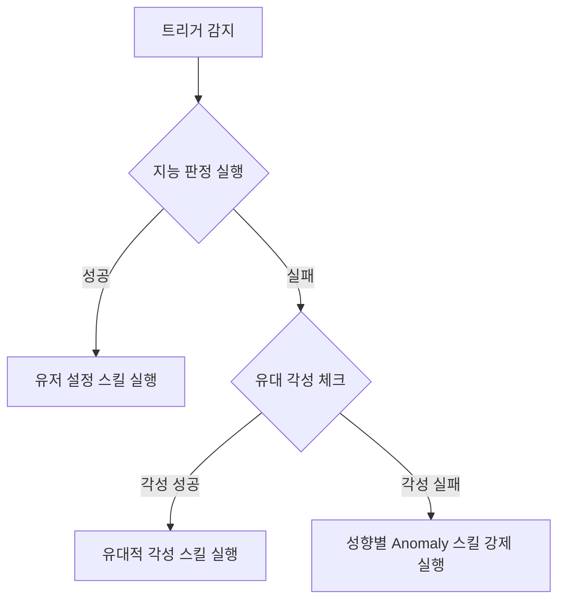

# 01. 캐릭터 작업 기획 (2차 빌드)

본 문서는 1차 빌드의 캐릭터 기획 사양을 바탕으로 2차 빌드에서 구현 및 고도화해야 할 캐릭터 스탯, 역할군, 성향(Trait), 지능 판정, 그리고 유대(Bond) 시스템의 세부 기획과 **플레이어 관점의 시각적 연출/UI 피드백**을 다룹니다.

---

## 1. 직업 스탯 및 성장 고도화

### 1.1. 기본 스탯 정의 및 계산식
캐릭터는 3가지 기본 스탯을 가지며, 스탯은 캐릭터의 전투 효율 및 리액션 통제에 직접 영향을 줍니다.

*   **STR (힘)**
    *   물리 공격력 보정: $Physics\_Damage = Base\_Damage + (STR \times 1.5)$
    *   최대 체력 보정: $Max\_HP = Base\_HP + (STR \times 10)$
*   **AGI (민첩)**
    *   행동 순서(속도) 보정: $Speed = Base\_Speed + (AGI \times 0.5)$
    *   치명타 확률 보정: $Crit\_Rate = Base\_Crit + (AGI \times 0.2\%)$
*   **INT (지능)**
    *   지원/치유 기술 보정: $Heal\_Power = Base\_Heal + (INT \times 1.2)$
    *   **통제력(INT Factor) 보정**: 스트레스 및 성향 불안정성을 억제하는 핵심 수치.
        *   $INT\_Factor = INT \times 0.5$ (소수점 버림)
        *   지능 판정 실패 시, 유대적 각성으로 전환되는 기본 확률에 보정치 추가: $Awakening\_Bonus\% = INT \times 0.3\%$

### 1.2. 직업별 스탯 성장 테이블 (레벨 1 ~ 10)
레벨업 시 직업별로 상승하는 스탯 가산치는 다음과 같습니다.

| 직업 | 레벨당 STR 증가량 | 레벨당 AGI 증가량 | 레벨당 INT 증가량 | 특이사항 |
| :--- | :---: | :---: | :---: | :--- |
| **전사 (Warrior)** | +3 | +1 | +1 | 높은 체력 및 물리 공격력 특화 |
| **도적 (Rogue)** | +1 | +3 | +1 | 빠른 행동 순서 및 치명타 특화 |
| **성직자 (Cleric)** | +1 | +1 | +3 | 높은 통제력(INT)으로 돌발 행동 최소화 |

---

## 2. 역할군 시스템 고도화

리더(플레이어)가 캐릭터에게 부여하는 역할(Role)에 따라 리액션 슬롯에 등록할 수 있는 추가 트리거가 개방되며, 전투 중 심리 안정성 보너스(`Role_Stability`)를 얻습니다.

| 역할군 | 활성화 트리거 조건 (Reaction Trigger) | 역할 안정성 (`Role_Stability`) | 기획 의도 |
| :--- | :--- | :---: | :--- |
| **탱커 (Tanker)** | - `[피격 시]`<br>- `[아군 위기 시 (아군 HP 30% 이하)]` | 15 | 아군을 보호하는 조건 발동. 피격에 대한 정신적 면역력 제공. |
| **딜러 (Dealer)** | - `[적 처치 시]`<br>- `[치명타 발생 시]` | 10 | 처치 및 치명타 등 공격적 시너지 중심 리액션 유도. |
| **서포터 (Supporter)**| - `[아군 턴 종료 시]`<br>- `[아군 상태이상 발생 시]` | 20 | 파티원 지원 조건 발동. 높은 심리적 안정감을 제공하여 돌발 억제. |

---

## 3. 성향(Trait) 및 Anomaly 스킬 확장 (시각 연출 및 대사 포함)

성향은 캐릭터의 내장 트리거와 연결되어 있으며, 지능 판정 실패 시 발동되는 **Anomaly 스킬(돌발 행동)**을 결정합니다. 성향 발동 시 플레이어에게 직관적인 시각적 연출과 대사를 제공하여 캐릭터성을 강조합니다.



### 3.1. 성향별 세부 스펙

#### ① 겁쟁이 (Cowardly)
*   **내장 트리거**: `[본인 체력 30% 이하 시]` 또는 `[적군 증원 시]`
*   **불안정 수치 (Instability)**: 25
*   **Anomaly 스킬**: **[비겁한 도망]**
    *   **효과**: 자신의 턴 순서를 맨 뒤로 미루고 후방 열(Position 3 또는 4)로 강제 이동하며 방어 태세(데미지 감소 50%)로 들어갑니다. 공격 행동 슬롯은 모두 취소됩니다.
*   **시각적 연출 (Visual Play)**:
    *   캐릭터 뒤쪽으로 땀방울 이펙트($\approx$ 물방울 파티클)가 흩날림.
    *   움츠러드는 모션 애니메이션 재생.
    *   머리 위에 파란색 해골 아이콘(공포 표시)이 나타났다가 사라짐.
*   **성향 발동 대사 예시**:
    *   *"히익! 살려줘! 나 먼저 살아야겠어!"*
    *   *"도망쳐야 해... 여긴 지옥이야!"*
    *   *"내, 내 몸에 손대지 마!"*

#### ② 이기주의 (Selfish)
*   **내장 트리거**: `[아군 위기 시 (아군 HP 30% 이하)]`
*   **불안정 수치 (Instability)**: 30
*   **Anomaly 스킬**: **[사리사욕]**
    *   **효과**: 위기에 빠진 아군을 돕는 리액션(예: 대신 맞기, 힐)을 거부합니다. 대신 자신에게 보호막(자신의 Max HP 20% 상당)을 부여하거나 자신에게 적용된 디버프를 아군에게 전가합니다.
*   **시각적 연출 (Visual Play)**:
    *   캐릭터가 팔짱을 끼거나 아군을 외면하며 고개를 돌리는 모션.
    *   아군 캐릭터 방향으로 보라색 화살표(디버프 전가 이펙트)가 날아감.
    *   자신에게는 반투명한 보라색 구형 보호막 이펙트 활성화.
*   **성향 발동 대사 예시**:
    *   *"너희 일은 너희가 알아서 해결해."*
    *   *"몸 간수 잘 하라고 했잖아? 나까지 휘말리게 하지 마."*
    *   *"내 안전이 먼저다. 미안하게 됐군."*

#### ③ 이타주의 (Altruistic)
*   **내장 트리거**: `[아군 피격 시]` 또는 `[아군 위기 시 (아군 HP 30% 이하)]`
*   **불안정 수치 (Instability)**: 15
*   **Anomaly 스킬**: **[맹목적 희생]**
    *   **효과**: 아군이 맞을 피해를 대신 받습니다 (피해량 100% 흡수). 단, 이 돌발 행동으로 피격 시 자신의 스트레스가 추가로 10 누적됩니다.
*   **시각적 연출 (Visual Play)**:
    *   타겟이 된 아군 앞으로 캐릭터가 빠르게 슬라이딩하며 끼어드는 애니메이션.
    *   빛나는 황금색 방패 또는 하트 모양 파티클이 캐릭터 전면에 팝업.
    *   피격 시 붉은색 스트레스 수치(+10)가 머리 위에 표시됨.
*   **성향 발동 대사 예시**:
    *   *"내가 막을 테니, 넌 뒤로 물러서!"*
    *   *"나 하나 다치더라도 동료는 지킨다!"*
    *   *"윽... 괜찮아, 이 정도는 버틸 수 있어!"*

#### ④ 광기 (Madness)
*   **내장 트리거**: `[본인 피격 시]` 또는 `[치명타 발생 시]`
*   **불안정 수치 (Instability)**: 45
*   **Anomaly 스킬**: **[피의 아리아]**
    *   **효과**: 이성을 잃고 무작위 대상(적군 혹은 아군 전체 중 1명)에게 일반 공격의 150% 데미지를 입히는 광역/단일 타격을 가합니다.
*   **시각적 연출 (Visual Play)**:
    *   화면 전체가 0.2초간 붉게 점멸(플래시 효과).
    *   캐릭터 눈에 붉은색 광폭화 안광 이펙트 부착.
    *   웃거나 소리 지르는 광기 모션 애니메이션과 검붉은색 타격 궤적 이펙트.
*   **성향 발동 대사 예시**:
    *   *"으하하하! 다 찢어발겨 주마! 적이든 아군이든!"*
    *   *"피... 피가 더 필요해! 뜨거운 피가!"*
    *   *"아프지? 나도 아파! 똑같이 느껴봐라!"*

#### ⑤ 호기심 (Curious)
*   **내장 트리거**: `[적 상태이상 발생 시]` 또는 `[미확인 오브젝트 감지 시]`
*   **불안정 수치 (Instability)**: 20
*   **Anomaly 스킬**: **[돌발 관찰]**
    *   **효과**: 설계된 리액션을 수행하는 대신 대상에게 무작위 디버프 1개를 추가 부여하거나, 자신의 방어력을 2턴간 20% 감소시키는 대신 아군 전체의 행동력을 10% 올리는 기묘한 행동을 취합니다.
*   **시각적 연출 (Visual Play)**:
    *   캐릭터 머리 위에 노란색 물음표(?) 파티클이 나타나 깜빡임.
    *   대상을 향해 돋보기를 들여다보거나 다가서서 관찰하는 엉뚱한 모션.
    *   초록색/노란색 빛 방울이 피아 캐릭터 주위로 흩뿌려짐.
*   **성향 발동 대사 예시**:
    *   *"오? 이건 무슨 현상이지? 아주 흥미로워!"*
    *   *"잠깐만! 방해하지 마 봐. 저걸 꼭 연구해야겠어."*
    *   *"가까이서 보면 어떤 반응이 일어날까?"*

---

## 4. 지능 판정 및 리액션 해결(Resolve) 프로세스 (시각 연출)

### 4.1. 판정 공식 수정 및 세부 계수
리액션 트리거가 감지되었을 때, 돌발 행동이 발생할 확률(`Fail_Chance`)을 계산하는 공식입니다.

$$Fail\_Chance(\%) = (Trait\_Instability + Current\_Stress) - (INT\_Factor + Role\_Stability)$$

### 4.2. Resolve_Reaction() 모듈 흐름 및 UI 표현

```
[이벤트 발생] 
      │
      ▼
[스캔 & 트리거 검출] (머리 위에 번개 모양 슬롯 활성화 연출)
      │
      ▼
[지능 판정 주사위 굴림] 
      │
      ├─► [성공] (이성 제어) ──► 녹색 이펙트 + 설계된 스킬 실행 (말풍선: "설계대로 간다!")
      │
      └─► [실패] (이성 상실) ──► 붉은색 경고 필터 + 2차 유대 체크
               │
               ├─► [각성 성공] ──► 황금색 캐릭터 컷인 ──► [유대 각성 스킬] 실행 (우호 대사)
               │
               └─► [각성 실패] ──► 성향 텍스트 팝업 ──► [Anomaly 스킬] 강제 실행 (성향 대사)
```

#### ① 판정 단계별 시각 피드백 디자인
1.  **트리거 감지 시**:
    *   화면상의 반응하는 캐릭터의 리액션 슬롯 UI(카드 형태)가 앞으로 툭 튀어나오며 밝게 빛나는 포커스 연출.
    *   캐릭터 머리 위에 일시적으로 **번개 모양 아이콘** 팝업.
2.  **판정 진행 중 (지능 판정)**:
    *   캐릭터 머리 위에 작은 주사위 또는 게이지바가 생성되어 빠르게 회전/채워지는 비주얼 힌트 제공.
3.  **지능 판정 실패 시 (본능 지배)**:
    *   화면에 붉은색 경고 테두리 필터가 짧게(0.3초) 나타났다 사라짐.
    *   성향 텍스트(예: **"광기!"**, **"이기주의!"**)가 화면 중앙에 사선으로 거칠게 타이포그래피 이펙트로 노출됨.
4.  **유대적 각성 전환 시 (구원 연출)**:
    *   돌발 행동을 억제하려는 동료와 해당 캐릭터의 일러스트 컷인(Cut-in)이 화면 좌우에서 슬라이딩하며 중앙에서 교차.
    *   배경이 어두워지고 두 캐릭터 사이를 잇는 황금색 사슬 이펙트 연결.
    *   **각성 대사** 출력: (예: *"정신 차려! 내 뒤에 있어!"* $\rightarrow$ *"고맙군, 덕분에 살았어!"*)

---

## 5. 유대(Bond) 시스템 설계 기초

2차 빌드에서 관계 기반 서사를 완성하기 위해, 캐릭터 간 일대일 유대 데이터 레이어를 구축합니다.

### 5.1. 유대 관계 데이터 구조 및 시각화
*   **Bond_Rate**: 캐릭터 A와 캐릭터 B 사이의 일대일 관계 수치 (범위: -100 ~ +100).
*   **시각화 방식**:
    *   **전투 UI**: 캐릭터 상태창에서 마우스를 오버하거나 유대 리액션 발생 시, 캐릭터 간 연결선이 그려지며 관계 수치가 표시됨.
    *   **우호 (+50 이상)**: 연결선이 굵은 **황금색 실선**으로 표현되며 하트 파티클이 흘러감.
    *   **경계 (-50 이하)**: 연결선이 깨진 **붉은색 점선**으로 표현되며 번개 파티클이 파닥임.

### 5.2. 전투 중 유대 변화 트리거 및 이펙트
전투 중 발생하는 리액션의 결과에 따라 유대 수치가 실시간으로 변동하며 화면에 실시간 피드백을 줍니다.

*   `[이타주의 성향으로 아군 대신 맞기 성공 시]`: 대신 맞은 대상과의 `Bond_Rate` **+5** (머리 위에 **"+5 ♥"** 이펙트 공중 부유)
*   `[이기주의 성향으로 아군 지원 거부 시]`: 도움을 받지 못한 대상과의 `Bond_Rate` **-10** (머리 위에 **"-10 ⚡"** 이펙트 팝업)
*   `[유대적 각성 스킬 발동 성공 시]`: 각성에 참여한 두 대원의 `Bond_Rate` **+8**
*   `[광기 성향으로 아군을 타격했을 시]`: 피해를 입은 아군과의 `Bond_Rate` **-20** (화면에 금이 가는 유리 이펙트와 함께 큰 붉은 폰트로 표시)
