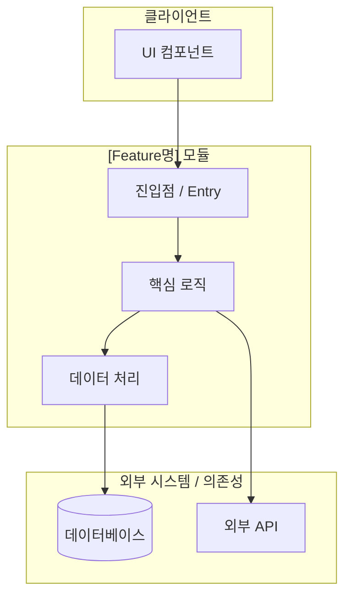
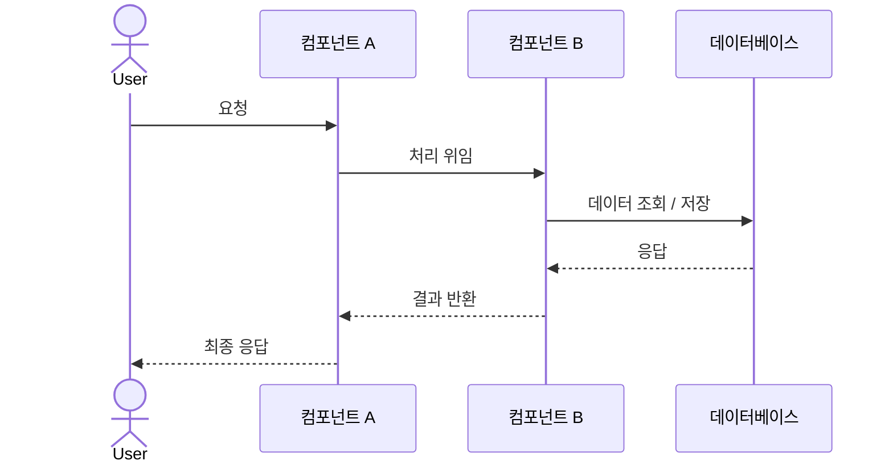

# 🔧 기술 문서 : [Feature명]
**작성일 :** YYYY-MM-DD  
**작성자 :**  
**최종 검토일 :**  
**상태 :** `작성 중` / `검토 중` / `확정`

> **문서 목적**  
> 이 문서는 [Feature명]의 설계 배경, 구현 방식, 기술적 의사결정 근거를 기록합니다.  
> 동료 개발자가 이 문서만으로 해당 기능을 이해하고 유지보수할 수 있는 수준을 목표로 합니다.

---

## 목차

1. [기능 개요](#1-기능-개요)
2. [시스템 구조](#2-시스템-구조)
3. [구현 상세](#3-구현-상세)
4. [기술 의사결정](#4-기술-의사결정)
5. [사용 가이드](#5-사용-가이드)
6. [테스트 및 검증](#6-테스트-및-검증)
7. [알려진 한계 및 향후 개선 방향](#7-알려진-한계-및-향후-개선-방향)
8. [관련 문서 및 참고 자료](#8-관련-문서-및-참고-자료)

---

## 1. 기능 개요

### 1-1. 배경 및 목적

> 이 기능이 왜 필요한가? 어떤 문제를 해결하는가?

- **배경 :**  
- **해결하려는 문제 :**  
- **기대 효과 :**  

### 1-2. 기능 범위 (Scope)

| 구분 | 내용 |
|------|------|
| **포함 (In-Scope)** | |
| **미포함 (Out-of-Scope)** | |
| **전제 조건** | |

### 1-3. 관련 작업 이력

| 날짜 | 작업 일지 | 내용 요약 |
|------|-----------|-----------|
| YYYY-MM-DD | [[일일 작업 일지] YYYY-MM-DD]() | |
| YYYY-MM-DD | [[주간 작업 일지] YYYY-MM-DD]() | |

---

## 2. 시스템 구조

### 2-1. 전체 구조 다이어그램



### 2-2. 데이터 흐름



### 2-3. 디렉토리 / 파일 구조

```
project/
├── src/
│   ├── feature-name/
│   │   ├── index.ts          # 진입점
│   │   ├── feature.service.ts # 핵심 로직
│   │   ├── feature.model.ts   # 데이터 모델
│   │   └── feature.util.ts    # 유틸리티
│   └── ...
└── ...
```

---

## 3. 구현 상세

> 단순 구현 항목은 코드와 간략한 설명으로 기술합니다.  
> 기술적 난관이 있었던 항목은 **4. 기술 의사결정** 섹션과 연결합니다.

### 3-1. [구현 항목 A]

- **역할 :**  
- **핵심 로직 설명 :**  

```typescript
// 핵심 코드 또는 예시
function exampleFunction(param: string): void {
    // 구현 내용
}
```

### 3-2. [구현 항목 B]

- **역할 :**  
- **핵심 로직 설명 :**  

```typescript
// 핵심 코드 또는 예시
```

### 3-3. [구현 항목 C] ← 기술적 판단이 필요했던 항목

- **역할 :**  
- **핵심 로직 설명 :**  
- **⚠️ 기술 의사결정 참조 →** [4-1. 의사결정 #1](#4-1-의사결정-1--제목)

```typescript
// 핵심 코드 또는 예시
```

---

## 4. 기술 의사결정

> 기술적 난관이 있었거나, 여러 대안 중 선택이 필요했던 항목만 기록합니다.  
> 단순 구현은 이 섹션을 생략하거나 항목에서 제외합니다.

---

### 4-1. 의사결정 #1 : [제목]

#### 문제 상황

> 어떤 기술적 문제 또는 요구사항이 있었는가?

#### 대안 비교

| 대안 | 장점 | 단점 | 검토 결과 |
|------|------|------|-----------|
| **대안 A** | | | ❌ 기각 |
| **대안 B** | | | ❌ 기각 |
| **대안 C** (채택) | | | ✅ 채택 |

#### 채택 근거 (Why)

> 단순 비교가 아닌, **이 프로젝트의 맥락**에서 왜 최선인지를 서술합니다.

- **성능 측면 :**  
- **유지보수 측면 :**  
- **프로젝트 적합성 :**  

#### 결과 및 검증

- **적용 후 성과 :**  
- **측정 지표 (있는 경우) :**  

---

### 4-2. 의사결정 #2 : [제목]

#### 문제 상황

#### 대안 비교

| 대안 | 장점 | 단점 | 검토 결과 |
|------|------|------|-----------|
| **대안 A** | | | ❌ 기각 |
| **대안 B** (채택) | | | ✅ 채택 |

#### 채택 근거 (Why)

#### 결과 및 검증

---

## 5. 사용 가이드

### 5-1. 환경 설정

```bash
# 필요한 환경 변수 또는 설정
```

| 환경 변수 | 설명 | 필수 여부 | 예시 |
|-----------|------|-----------|------|
| `VAR_NAME` | 설명 | 필수 | `value` |

### 5-2. 기본 사용법

**Step 1. [단계명]**
```bash
# 명령어 또는 코드
```

**Step 2. [단계명]**
```bash
# 명령어 또는 코드
```

### 5-3. 주요 인터페이스 / API

| 메서드 / 엔드포인트 | 설명 | 파라미터 | 반환값 |
|---------------------|------|----------|--------|
| `functionName()` | | | |
| `POST /api/endpoint` | | | |

### 5-4. 주의 사항

> ⚠️ 운영 또는 사용 시 반드시 알아야 할 사항

- 주의 사항 1  
- 주의 사항 2  

---

## 6. 테스트 및 검증

### 6-1. 테스트 항목

| 테스트 케이스 | 입력 | 기대 결과 | 결과 |
|---------------|------|-----------|------|
| 정상 케이스 1 | | | ✅ |
| 엣지 케이스 1 | | | ✅ |
| 실패 케이스 1 | | | ✅ |

### 6-2. 테스트 실행 방법

```bash
# 테스트 명령어
```

### 6-3. 검증 기준

- **기능 검증 :**  
- **성능 검증 :**  
- **예외 처리 검증 :**  

---

## 7. 알려진 한계 및 향후 개선 방향

| 구분 | 내용 | 우선순위 |
|------|------|----------|
| **현재 한계** | | - |
| **개선 방향** | | 🔴 / 🟡 / 🟢 |
| **기술 부채** | | 🔴 / 🟡 / 🟢 |

---

## 8. 관련 문서 및 참고 자료

| 구분 | 문서명 | 링크 |
|------|--------|------|
| 작업 일지 | [일일 작업 일지] YYYY-MM-DD | |
| 작업 일지 | [주간 작업 일지] YYYY-MM-DD | |
| 기술 문서 | [기술 문서][관련 Feature] | |
| 외부 참고 | 라이브러리 공식 문서 | |

---

*작성 완료 : YYYY-MM-DD HH:MM*
