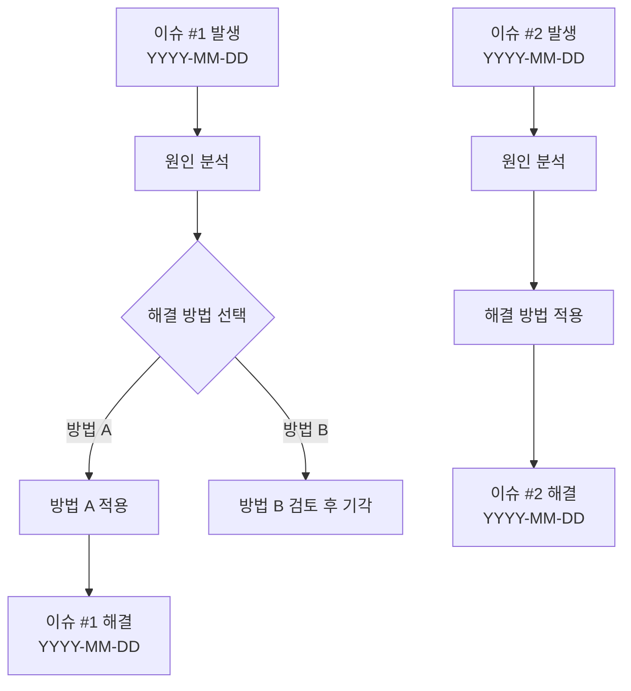
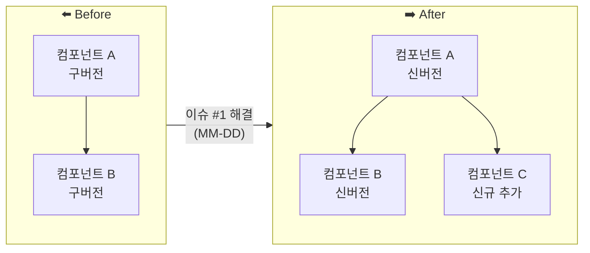

# 📊 주간 작업 일지
**기간 :** YYYY-MM-DD ~ YYYY-MM-DD  
**작성자 :**   

---

## 1. 주간 작업 개요

> 이번 주 작업 내용의 핵심만 한눈에 파악할 수 있도록 간결하게 작성합니다.  
> 상세 내용은 각 일일 작업 일지를 참조하세요.

| 날짜 | 주요 작업 | 비고 |
|------|-----------|------|
| MM-DD (월) | | |
| MM-DD (화) | | |
| MM-DD (수) | | |
| MM-DD (목) | | |
| MM-DD (금) | | |

---

## 2. 문제 사항 / 변경 사항 / 주요 성과

> 이번 주 발생한 주요 이슈와 해결 내용을 Before/After 구조로 요약합니다.  
> 상세 내용은 각 일일 작업 일지 링크를 참조합니다.

---

### 📌 이슈 #1 : [이슈 제목]

| 구분 | 내용 |
|------|------|
| **Before** | (변경 전 상태 요약) |
| **After** | (변경 후 상태 요약) |
| **일일 작업 일지** | [[일일 작업 일지] YYYY-MM-DD](./%5B일일%20작업%20일지%5DYYYY-MM-DD.md) |

---

### 📌 이슈 #2 : [이슈 제목]

| 구분 | 내용 |
|------|------|
| **Before** | |
| **After** | |
| **일일 작업 일지** | [[일일 작업 일지] YYYY-MM-DD](./%5B일일%20작업%20일지%5DYYYY-MM-DD.md) |

---

### 📌 이슈 #3 : [이슈 제목]

| 구분 | 내용 |
|------|------|
| **Before** | |
| **After** | |
| **일일 작업 일지** | [[일일 작업 일지] YYYY-MM-DD](./%5B일일%20작업%20일지%5DYYYY-MM-DD.md) |

---

## 3. 작업 흐름 도표

> 이번 주 작업물들의 관계와 흐름을 Mermaid 문법으로 시각화합니다.

### 3-1. 작업 진행 흐름



### 3-2. 변경 사항 Before / After 구조



### 3-3. 주간 작업 타임라인

```mermaid
gantt
    title 주간 작업 타임라인 (YYYY-MM-DD ~ YYYY-MM-DD)
    dateFormat  YYYY-MM-DD
    section 이슈 대응
        이슈 #1 분석         :done,    issue1a, YYYY-MM-DD, 1d
        이슈 #1 해결         :done,    issue1b, after issue1a, 1d
        이슈 #2 분석 및 해결 :done,    issue2,  YYYY-MM-DD, 2d
    section 기능 개발
        기능 A 개발          :active,  featureA, YYYY-MM-DD, 3d
        기능 B 개발          :         featureB, after featureA, 2d
    section 테스트
        통합 테스트          :         test, YYYY-MM-DD, 1d
```

---

## 4. 다음 주 작업 예정

> 이번 주 미완료 항목 및 다음 주 예정 작업을 기록합니다.

| 우선순위 | 작업 내용 | 예상 소요 | 비고 |
|----------|-----------|-----------|------|
| 🔴 높음 | | | |
| 🟡 중간 | | | |
| 🟢 낮음 | | | |

---

## 5. 참고 링크 및 일일 작업 일지 목록

| 날짜 | 일일 작업 일지 링크 | 주요 내용 |
|------|---------------------|-----------|
| YYYY-MM-DD | [[일일 작업 일지] YYYY-MM-DD](./%5B일일%20작업%20일지%5DYYYY-MM-DD.md) | |
| YYYY-MM-DD | [[일일 작업 일지] YYYY-MM-DD](./%5B일일%20작업%20일지%5DYYYY-MM-DD.md) | |
| YYYY-MM-DD | [[일일 작업 일지] YYYY-MM-DD](./%5B일일%20작업%20일지%5DYYYY-MM-DD.md) | |
| YYYY-MM-DD | [[일일 작업 일지] YYYY-MM-DD](./%5B일일%20작업%20일지%5DYYYY-MM-DD.md) | |
| YYYY-MM-DD | [[일일 작업 일지] YYYY-MM-DD](./%5B일일%20작업%20일지%5DYYYY-MM-DD.md) | |

---

*작성 완료 : YYYY-MM-DD HH:MM*
